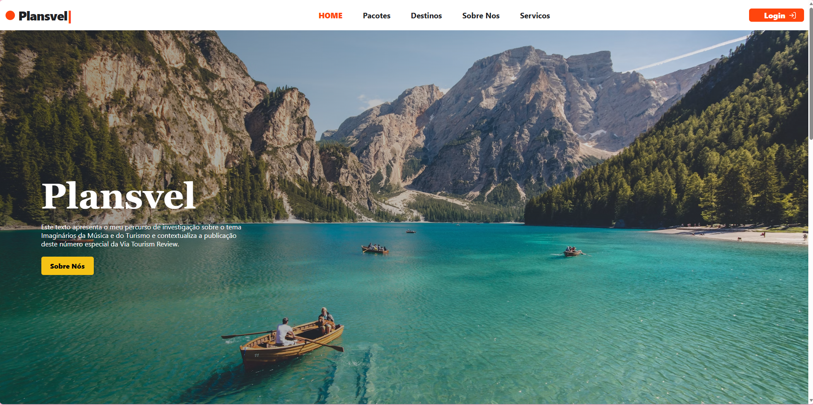

# SmartTravel Booking Engine

Marca visual: **Plansvel**

Plataforma full stack de turismo para busca, comparacao e reserva de hoteis, voos, pacotes e experiencias. O projeto usa um monolito modular com Clean Architecture simplificada para demonstrar arquitetura escalavel sem criar complexidade desnecessaria no inicio.



## Arquitetura

Este projeto segue uma abordagem de **Clean Architecture Simplificada em um Monolito Modular**: os dominios ficam separados por modulos, mas a aplicacao continua simples de executar, testar e evoluir.

- Documentacao oficial do projeto: [docs/arquitetura.md](docs/arquitetura.md)
- Referencia Clean Architecture: [The Clean Architecture - Robert C. Martin](https://blog.cleancoder.com/uncle-bob/2012/08/13/the-clean-architecture.html)
- Repositorio oficial: [SamLoboTi/modular-com-Clean-Architecture-simplificada](https://github.com/SamLoboTi/modular-com-Clean-Architecture-simplificada)

## Stack

- Backend: Python, Django, Django REST Framework, PostgreSQL
- Frontend: React, TypeScript, Shadcn UI como referencia visual, Recharts
- Qualidade: pytest, pytest-bdd, GitHub Actions
- Futuro: Docker, Redis, Celery, Render/Railway/Azure

## Estrutura

```txt
backend/src
frontend/src
docs
.github/workflows
```

## Como rodar

Backend:

```bash
cd backend
python -m venv .venv
source .venv/bin/activate
pip install -r requirements.txt
python manage.py migrate
python manage.py runserver
```

Frontend:

```bash
cd frontend
npm install
npm run dev
```

## CI/CD

O workflow em `.github/workflows/ci.yml` executa testes do backend e build do frontend a cada push ou pull request.
